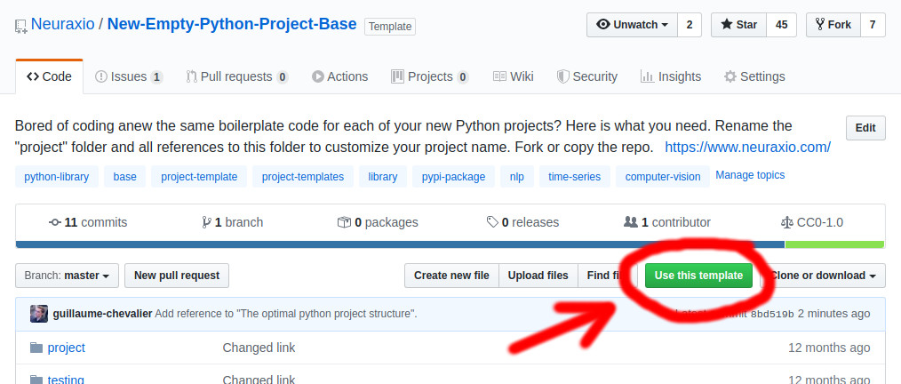

# [New Empty Python Project Base](https://github.com/Neuraxio/New-Empty-Python-Project-Base)

> This is just what you need to start a new Python project.

Simply use this project template to start new python projects.

## Using this template for your project (how to)

You can now automatically create a new project based on this template by [clicking here on `Use this template`](https://github.com/Neuraxio/New-Empty-Python-Project-Base/generate), or by clicking on the button above in the repo, as depicted in the image below. If you don't use GitHub, you may as well simply clone this repository. 

## Adapting it for your own project

1. Rename the `project/` folder (and all references to this folder in other files) to customize your project name that is currently named `project` as per the folder's name. 
2. You can run tests by running `pytest` in the root, or by running `python3 setup.py test`. Code coverage is enabled with pytest-cov.
3. Edit the `setup.py` of your project to make it truly yours. Remove my email and info from here and put your own info. You may as well delete the full `setup.py` file instead of adapting it if you don't intend to publish your project on `pip` nor on `conda` as  a package. 
4. Start coding in your now-renamed project folder and add some more tests under the `testing/` folder!

### If building a package: Deploying your new package to PyPI

[Upload](https://packaging.python.org/tutorials/packaging-projects/) your project as a package on [PyPI](https://pypi.org/), the Python Package Index, to make it available on `pip`! (optional)

To do that, read my short step by step guide on [How to deploy a new package (or version of package) to PyPI](https://github.com/Neuraxio/Neuraxle/wiki/How-to-deploy-a-new-package-(or-version-of-package)-to-PyPI). 

### If building a REST API app (e.g.: SaaS): Structuring your software architecture's layers

I have recorded here my tips and tricks, what to look for, and how to structure your application for it to be clean in terms of software architecture: https://youtu.be/K4QN27IKr0g?t=1211

## Understanding how this template works

The article [The optimal python project structure](https://awaywithideas.com/the-optimal-python-project-structure/?ref=gucci_neuraxio) by Luke Tonin does a good job at explaining how a template like the present one works. The present template is a bit more complete and complex than in the article, thought, as it already includes a test suite (including a starter test example), and a thorough `setup.py` file for your project to be properly packaged. 

There is also my [video on software architecture](https://youtu.be/K4QN27IKr0g?t=1211) that can help, in which I do the overview of a full project based on this template, in terms of theoretical software architecture rather than practical how-to use the template. 

## License

To the extent possible under law, [Guillaume Chevalier](https://github.com/guillaume-chevalier) and [Neuraxio Inc.](https://github.com/Neuraxio) have waived all copyright and related or neighboring rights to this work.

Citations that link to this repository will be appreciated, but are not required.
